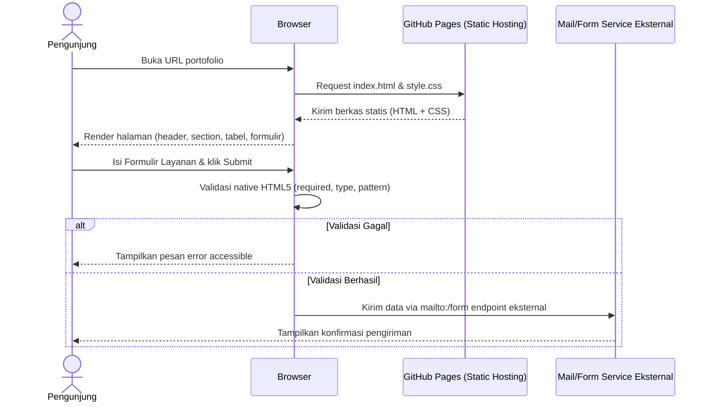
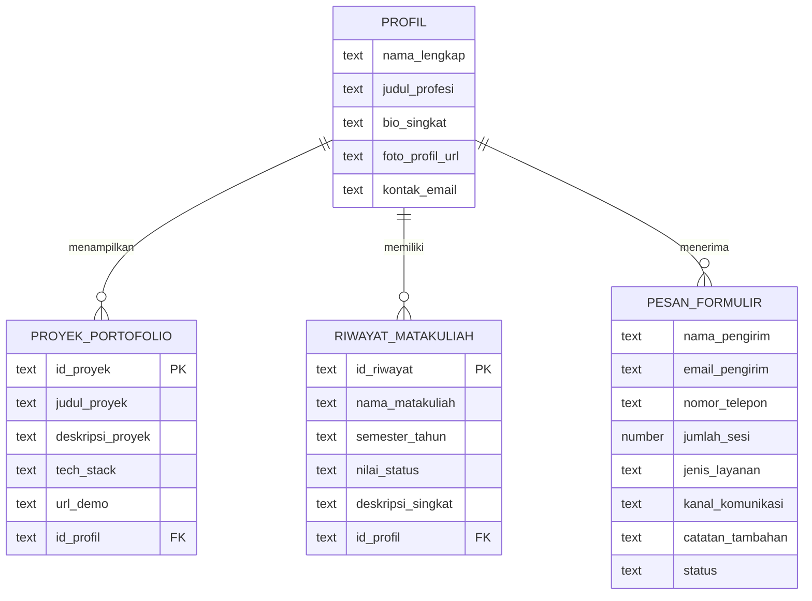

# PRD: Halaman Web Portofolio & Layanan Interaktif Accessible
*(Repositori: `ppw-2026-week2-[NIM]`)*

## 1. **Overview**

Aplikasi ini adalah *single page portfolio website* profesional untuk mahasiswa, dibangun sepenuhnya dengan HTML5 semantik dan CSS3 modern tanpa framework atau backend, sebagai tugas mandiri individu untuk melatih kompetensi *front-end development* dasar yang *accessible* (WCAG 2.2 Level AA). Model penggunaannya adalah personal branding page (bukan aplikasi komersial): satu mahasiswa berperan sebagai pemilik konten (*content owner*), sementara publik (dosen, calon *recruiter*, sesama mahasiswa) berperan sebagai pengunjung yang menilai dan menghubungi lewat formulir resmi.

**Masalah yang diselesaikan:** Mahasiswa umumnya menyimpan bukti capaian akademik dan proyek secara tersebar — CV dalam PDF, kode di folder terpisah, dan komunikasi lewat chat pribadi yang tidak profesional serta sulit dilacak oleh pihak yang ingin menilai atau menggunakan jasanya. Tidak ada satu titik akses terstruktur yang menampilkan identitas, riwayat akademik/proyek, dan jalur kontak resmi sekaligus.

**Tujuan Utama:** Dari sisi pengunjung (dosen/*recruiter*/klien), halaman ini memberi satu titik akses untuk menilai identitas, riwayat matakuliah/proyek, dan portofolio karya secara cepat dan rapi, sekaligus jalur formulir resmi untuk mengajukan konsultasi atau kerja sama. Dari sisi pemilik (mahasiswa), halaman ini menjadi representasi digital yang *accessible*, mudah di-*maintain* karena kode terorganisir rapi (termasuk untuk pemula), gratis di-*deploy* lewat GitHub Pages, sekaligus menjadi bukti kompetensi teknis sesuai rubrik penilaian.

## 2. **Requirements**

- **Struktur Semantik Wajib:** Gunakan `<header>` (logo & navigasi), `<nav>`, `<main>`, minimal 3 `<section>` (Tentang Saya, Portofolio Karya, Formulir Layanan), `<aside>`, dan `<footer>` sebagai kerangka *document outline*; hindari `
` pembungkus tanpa makna semantik.
- **Aksesibilitas WCAG 2.2 AA:** Pastikan kontras warna teks-latar memenuhi rasio minimum, setiap kontrol formulir punya `<label for="...">` eksplisit, navigasi bisa diakses lewat keyboard (fokus terlihat jelas), dan gambar punya atribut `alt` deskriptif.
- **Presentasi Data Tabular Semantik:** Satu tabel riwayat matakuliah/proyek wajib memakai `<table>`, `<thead>`, `<tbody>`, `<tfoot>`, `<caption>`, dan atribut `scope="col"`/`scope="row"` yang benar.
- **Dua Jenis List Terstruktur:** Sediakan `<ul>` (misal daftar *skill*/teknologi) dan `<ol>` (misal tahapan proses kerja atau *timeline* proyek) sebagai representasi konten non-tabular.
- **Formulir Interaktif Tervalidasi:** Minimal 2 blok `<fieldset>` + `<legend>`, minimal 6 tipe *input* berbeda (text, email, tel, number, radio, checkbox, select, textarea), validasi murni *native* HTML5 (`required`, `type`, `pattern`) karena tidak ada backend kustom.
- **Desain Visual Modern, Bukan *AI Slop*:** Terapkan aturan warna 60-30-10 dengan tema dominan putih & elegan (60% putih/netral terang, 30% abu gelap/*navy* untuk teks, 10% satu aksen warna *muted* untuk CTA), tipografi modern maksimal 2 *font family*, `border-radius` dan `box-shadow` sebagai token desain konsisten — hindari gaya generik seperti *gradient* ungu-biru default atau ikon *stock* pasaran.
- **Layout Responsif *Mobile-First*:** Tata letak berbasis CSS Flexbox atau CSS Grid, dengan *breakpoint* wajib via `@media (max-width: 768px)`, teruji di ukuran *mobile*, tablet, dan *desktop*.
- **Kode Rapi & Mudah Dibaca Pemula:** Indentasi konsisten, penamaan *class* deskriptif (bukan `div1`, `box2`), komentar penanda tiap bagian penting di HTML maupun CSS, `style.css` sebagai file eksternal terpisah (tanpa *inline style*).
- **Version Control & Deployment:** Kode dikelola di repositori GitHub publik bernama `ppw-2026-week2-[NIM]`, dilengkapi `README.md` informatif, dan dipublikasikan *live* lewat GitHub Pages.

## 3. **Core Features**

- **Header & Navigasi Sticky:** Menampilkan logo/nama mahasiswa dan menu `<nav>` yang tetap terlihat (*sticky*) saat *scroll*, dengan tautan *anchor* yang membawa pengunjung *smooth-scroll* ke tiap `<section>` dalam waktu kurang dari 1 detik.
- **Section Tentang Saya (Hero + Bio):** Menampilkan foto profil, judul profesi, ringkasan bio singkat, dan tautan sosial/CV dalam layout dua kolom (Grid/Flexbox) di *desktop*, berubah jadi satu kolom di layar di bawah 768px.
- **Galeri Portofolio Terstruktur:** *Grid* CSS menampilkan minimal 3 kartu proyek (judul, deskripsi singkat, *tech stack*, tautan demo/repo), dengan efek *hover* lembut (bayangan/`border-radius`) tanpa animasi berlebihan.
- **Tabel Riwayat Matakuliah/Proyek:** Tabel semantik lengkap (`caption`, `scope`) menampilkan minimal 5 baris data (nama matakuliah/proyek, semester/tahun, nilai/status, catatan singkat), dengan `<tfoot>` untuk baris ringkasan.
- **Formulir Pemesanan Layanan Accessible:** 2 blok `<fieldset>` (Data Diri & Detail Layanan) dengan minimal 6 tipe *input*, validasi *native* real-time, pesan galat yang jelas secara visual, tombol *submit* mengarah ke `mailto:` atau layanan formulir eksternal agar tetap berfungsi tanpa backend.
- **Aside Info & Footer Kontak:** `<aside>` berisi info tambahan singkat (misal *badge* keahlian atau testimoni singkat), dan `<footer>` menutup halaman dengan hak cipta, tautan sosial, dan info kontak resmi.

## 4. **User Flow**

**Flow Pengunjung (Visitor):**
1. Membuka URL GitHub Pages halaman portofolio dari *browser* (*desktop* atau *mobile*).
2. Melihat `<header>` dengan logo/nama dan menu navigasi.
3. Mengklik salah satu tautan `<nav>` (misal "Portofolio"), halaman *scroll* otomatis ke `<section>` terkait.
4. Membaca `<section>` "Tentang Saya" untuk mengenal identitas akademik mahasiswa.
5. Menelusuri galeri portofolio karya dan tabel riwayat matakuliah/proyek untuk menilai kompetensi.
6. Mengisi Formulir Layanan: melengkapi *fieldset* Data Diri lalu *fieldset* Detail Layanan.
7. Mengklik *submit*; *browser* menjalankan validasi *native* (menandai *field* wajib yang kosong/format salah).
8. Setelah validasi lolos, data terkirim lewat `mailto:`/layanan eksternal, dan pengunjung melihat pesan konfirmasi.

**Flow Mahasiswa (Pemilik/Developer):**
1. Menulis struktur HTML5 semantik di `index.html` sesuai kerangka wajib.
2. Menulis *styling* eksternal di `style.css` sesuai palet 60-30-10 dan layout Flexbox/Grid.
3. Menguji tampilan responsif lewat DevTools pada *breakpoint* 768px.
4. Melakukan *commit* & *push* kode ke repositori GitHub publik `ppw-2026-week2-[NIM]`.
5. Menulis `README.md` berisi deskripsi proyek, cara membuka, dan tautan *live demo*.
6. Mengaktifkan GitHub Pages dari pengaturan repositori dan memverifikasi halaman dapat diakses publik.

## 5. **Architecture**

Arsitektur yang dipilih adalah *static site* murni — HTML5 + CSS3 tanpa *framework* JavaScript maupun *server backend* — karena spesifikasi tugas mewajibkan HTML/CSS murni, dan pendekatan ini paling cocok untuk skala tugas individu: satu repositori, tanpa *build tool*/*bundler*, sehingga kode mudah dibaca langsung oleh pemula dari *browser*. Karena tidak ada *backend* atau *database* sungguhan, seluruh konten (profil, proyek, riwayat matakuliah) bersifat statis dan di-*hardcode* langsung di *markup* HTML; formulir layanan diarahkan ke layanan eksternal (`mailto:` atau *form endpoint* pihak ketiga) agar tetap fungsional tanpa perlu *server* kustom. Hosting dilakukan lewat GitHub Pages yang menyajikan berkas statis langsung dari *branch* repositori tanpa *server-side rendering*.

## 6. **Database Schema**

> Catatan: Karena aplikasi ini adalah *static website* tanpa *backend*/*database* sungguhan sesuai spesifikasi tugas, skema berikut adalah representasi **konseptual** struktur konten yang akan di-*hardcode* di *markup* HTML — bukan tabel database yang tersimpan di server. Tujuannya agar konten profil, proyek, dan riwayat tetap terstruktur konsisten saat ditulis ke HTML.

Relasi utamanya: satu **Profil** memiliki banyak **Proyek Portofolio** dan banyak **Riwayat Matakuliah**, serta menerima banyak **Pesan Formulir** dari pengunjung.

1. **`Profil (Profile)`** - identitas akademik pemilik portofolio (satu entitas tunggal, di-*hardcode*).
   - `nama_lengkap` (Text): Nama lengkap mahasiswa, ditampilkan di header/hero.
   - `judul_profesi` (Text): *Tagline* profesi/bidang keahlian.
   - `bio_singkat` (Text): Paragraf ringkas "Tentang Saya".
   - `foto_profil_url` (Text): Path ke aset gambar foto profil.
   - `kontak_email` (Text): Alamat email untuk footer/kontak.

2. **`Proyek Portofolio (PortfolioProject)`** - daftar karya di galeri.
   - `id_proyek` (Text) *Primary Key*.
   - `judul_proyek` (Text): Nama proyek yang tampil di kartu.
   - `deskripsi_proyek` (Text): Ringkasan singkat proyek.
   - `tech_stack` (Text): Daftar teknologi yang dipakai.
   - `url_demo` (Text): Tautan ke demo *live* atau repositori.
   - `id_profil` (Text) *Foreign Key* → `Profil.nama_lengkap`.

3. **`Riwayat Matakuliah/Proyek (AcademicRecord)`** - baris data tabel semantik riwayat akademik.
   - `id_riwayat` (Text) *Primary Key*.
   - `nama_matakuliah` (Text): Nama matakuliah/proyek akademik.
   - `semester_tahun` (Text): Periode pengambilan.
   - `nilai_status` (Text): Nilai huruf atau status penyelesaian.
   - `deskripsi_singkat` (Text): Catatan tambahan pada kolom tabel.
   - `id_profil` (Text) *Foreign Key* → `Profil.nama_lengkap`.

4. **`Pesan Formulir Layanan (ServiceInquiry)`** - struktur *field* yang dikirim lewat formulir (tidak disimpan permanen karena tanpa *backend*).
   - `nama_pengirim` (Text): Diisi via `input type="text"`, wajib.
   - `email_pengirim` (Text): Diisi via `input type="email"`, wajib.
   - `nomor_telepon` (Text): Diisi via `input type="tel"`.
   - `jumlah_sesi` (Number): Diisi via `input type="number"`.
   - `jenis_layanan` (Text): Dipilih via *radio*/*select*, enum: `KONSULTASI`, `PENGEMBANGAN_WEB`, `LAINNYA`.
   - `kanal_komunikasi` (Text): Dipilih via *checkbox* (multi-pilih), misal Email/WhatsApp/Telepon.
   - `catatan_tambahan` (Text): Diisi via *textarea*, opsional.
   - `status` (Text): *state* UI klien, enum `PENDING_SEND`, `SENT`, `FAILED`.

## 7. **Tech Stack**

- **Framework Fullstack:** Tidak menggunakan *framework* (**Vanilla HTML5**) — karena tugas mewajibkan HTML murni tanpa *build tool*, dan untuk skala tugas individu satu berkas `index.html` sudah cukup tanpa kompleksitas *bundler*.
- **Styling/UI:** **CSS3 Native** lewat berkas eksternal `style.css` — tanpa Tailwind/framework CSS agar benar-benar mempraktikkan *box model*, Flexbox/Grid, dan *media query* sesuai rubrik; tema **putih & elegan** mengikuti rasio 60-30-10 (60% putih/netral terang, 30% abu gelap untuk teks, 10% satu aksen warna *muted* seperti emas pudar atau hijau tua untuk CTA), tipografi modern via *Google Fonts* atau *system font stack*.
- **Database:** **Tidak ada (N/A)** — halaman statis tanpa penyimpanan data; seluruh konten di-*hardcode* langsung di *markup* HTML.
- **ORM:** **Tidak ada (N/A)** — konsekuensi logis dari tidak adanya database.
- **Autentikasi:** **Tidak ada (N/A)** — halaman portofolio bersifat publik tanpa *login*/*role*, sehingga autentikasi tidak relevan untuk MVP tugas ini.
- **Deployment:** **GitHub Pages** — sesuai spesifikasi wajib tugas, gratis, langsung menyajikan berkas statis dari repositori publik `ppw-2026-week2-[NIM]` tanpa konfigurasi *server* tambahan.
