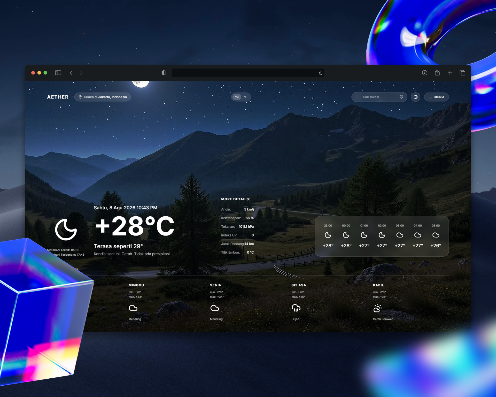
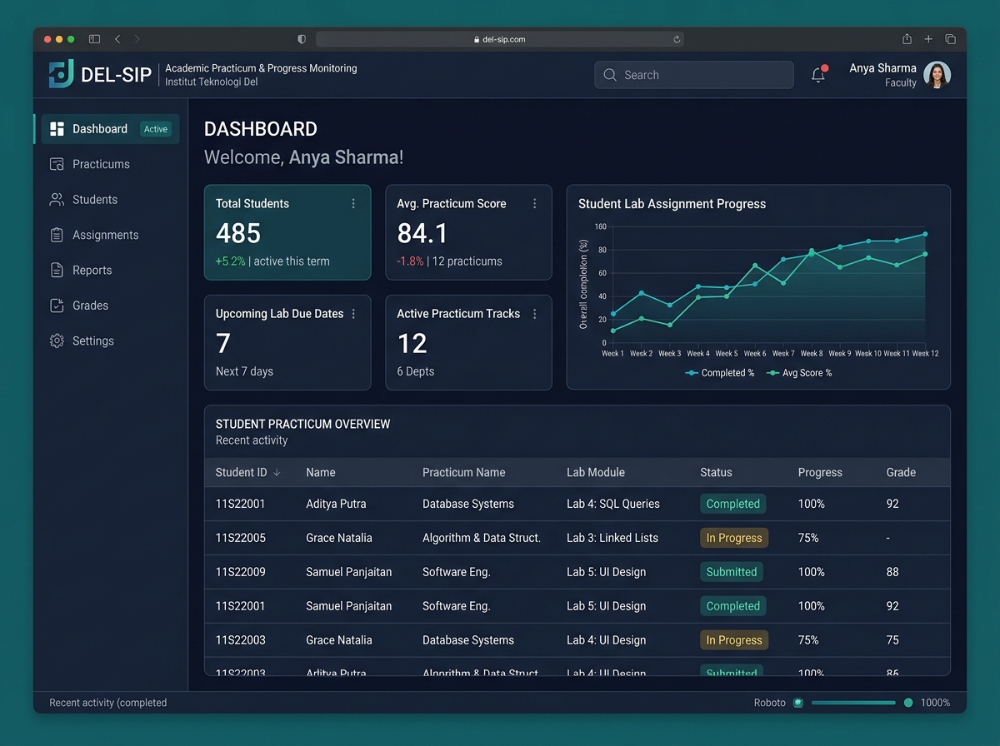
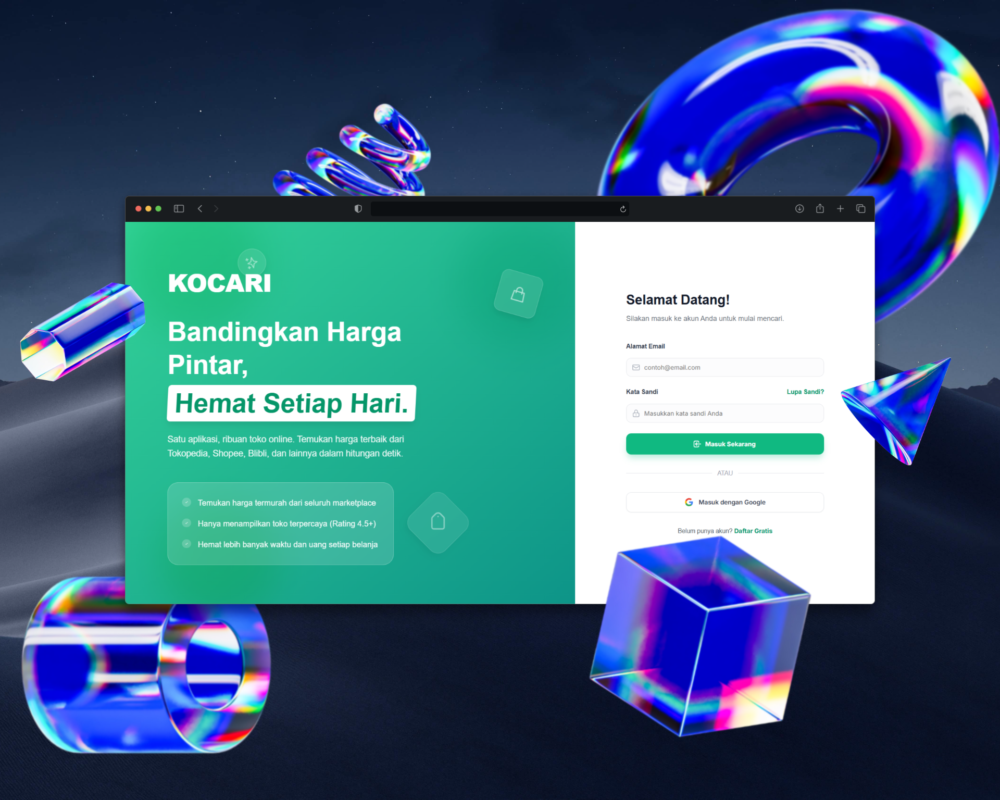

# PPW Portofolio Project — Boy Harendy Simamora
### Refactoring Berbasis Bootstrap 5 & Advanced Custom CSS (Tugas Praktikum Minggu 03)

Website portofolio pribadi dan portal layanan interaktif **Boy Harendy Simamora** (Mahasiswa S1 Sistem Informasi Institut Teknologi Del). Proyek ini merupakan kelanjutan dan pemutakhiran (*refactoring*) menyeluruh dari Tugas Minggu 2, kini mengadopsi standar **Bootstrap 5.3+ CDN**, arsitektur grid responsif 12-kolom, dialog modal interaktif, formulir modern dengan *Floating Labels*, dan kustomisasi variabel CSS tingkat lanjut tanpa mengorbankan integritas semantik **HTML5** dan standar aksesibilitas **WCAG 2.2 AA**.

🌐 **Live Demo GitHub Pages:** [https://boyharendy.github.io/PPW-Portofolio-Project/](https://boyharendy.github.io/PPW-Portofolio-Project/)  
📦 **Branch Khusus Minggu 3:** `week3-bootstrap`

---

## 👤 Identitas Mahasiswa

| Keterangan | Informasi Resmi |
| :--- | :--- |
| **Nama Lengkap** | Boy Harendy Simamora |
| **NIM** | 12S24016 |
| **Program Studi** | S1 Sistem Informasi |
| **Fakultas** | Informatika dan Teknik Elektro (FITE) |
| **Institusi** | Institut Teknologi Del |
| **Mata Kuliah** | Pemrograman dan Pengujian Web (12S3101) |
| **Tahun Akademik** | Semester Ganjil 2026/2027 |

---

## 📊 Tabel Komparasi: Sebelum vs Sesudah Integrasi Framework

Sesuai spesifikasi teknis penugasan Modul 3, berikut adalah perbandingan komparatif arsitektur antarmuka dan basis kode antara **Minggu 2** (Pure Semantic HTML5 & CSS3) dengan **Minggu 3** (Bootstrap 5.3 + Advanced Custom Overrides):

| Aspek / Komponen | Minggu 2 (Sebelum Refactoring) | Minggu 3 (Sesudah Integrasi Bootstrap 5) |
| :--- | :--- | :--- |
| **Pondasi & Framework** | Pure Vanilla CSS murni tanpa dependensi eksternal. | **Bootstrap 5.3.3 CDN** (CSS & JS bundle) + **Bootstrap Icons 1.11.3 CDN**. |
| **Arsitektur Urutan CSS** | 1 berkas `style.css` independen. | `style.css` dimuat **setelah** Bootstrap CSS untuk *custom overrides* yang elegan sesuai algoritma cascading. |
| **Navigasi (Navbar)** | Flexbox custom statis di mobile; menu link membentang langsung. | **Responsive Navbar Bootstrap** (`sticky-top`) dengan tombol hamburger collapse (`navbar-toggler`) yang berfungsi mulus di layar ponsel tanpa error console. |
| **Tata Letak Hero Section** | CSS Flexbox manual dengan media queries kustom. | **Bootstrap 12-Column Grid** (`row`, `col-12`, `col-lg-7`, `col-lg-5`) responsif multi-perangkat. |
| **Galeri Portofolio** | 3 kartu proyek menggunakan CSS Grid murni. | **Minimal 4 kartu proyek** (`.card.h-100`) dalam grid responsif (`row-cols-1 row-cols-md-2 g-4`), ditambah proyek baru: **DEL-SIP Portal Monitoring Praktikum**. |
| **Interaktivitas Detail Proyek** | Tautan eksternal biasa tanpa popup. | **Bootstrap Modal Dialog (`.modal.fade`)** interaktif di setiap kartu (4 modal unik berisi latar belakang, arsitektur, dan fitur proyek). |
| **Formulir Layanan** | Form HTML5 native dengan label dan input standar. | Modernisasi komponen Bootstrap: **Floating Labels** (`.form-floating`), **Input Groups** berikon, dropdown select kustom, dan checkbox S&K. |
| **Validasi Formulir** | Validasi bawaan peramban (*browser default tooltip*). | **Validasi Visual Interaktif Bootstrap 5** (`needs-validation`, `.valid-feedback`, `.invalid-feedback`) dengan skrip JavaScript terkontrol. |
| **Pengelolaan Tema & Variabel** | Variabel CSS terbatas pada `:root`. | **$\ge 6$ CSS Variables terstruktur** pada `:root` (`--brand-primary`, `--brand-hover`, `--brand-accent`, `--card-radius`, `--shadow-lift`, dll.) dengan palet khas *Deep Teal & Slate*. |
| **Mikro-Interaksi Kartu** | Transformasi translateY standar. | **Lab 1 Micro-interaction**: Garis aksen animasi pseudo-element `::before` (`scaleX(0)` $\rightarrow$ `scaleX(1)`) dikombinasikan dengan elevasi `box-shadow`. |
| **Kepatuhan Aturan CSS** | Tanpa aturan spesifisitas ketat. | **Zero arbitrary `!important`**; seluruh override framework ditangani melalui selektor spesifisitas yang terencana. |

---

## 📸 Dokumentasi Antarmuka (Screenshots)

### 1. Desktop View (Hero & Responsive Sticky Navbar)


### 2. Grid Portofolio Responsif & Modal Dialog Detail


### 3. Formulir Layanan Modern (Floating Labels & Input Groups)


---

## 🛠️ Pustaka & Teknologi yang Digunakan

1. **Bootstrap 5.3.3 (CDN):** Sistem grid 12-kolom responsif, Flexbox utilities, Card components, Modal dialog, dan Floating form controls.
2. **Bootstrap Icons 1.11.3 (CDN):** Ikonografi vektor SVG untuk input fields, status badges, dan tombol navigasi.
3. **HTML5 Semantik:** Struktur dokumen tetap menggunakan elemen semantik standar (`header`, `nav`, `main`, `section`, `article`, `figure`, `dl`, `aside`, `footer`, `address`).
4. **Advanced Custom CSS Overrides:** Variabel global `:root`, animasi pseudo-elements `::before`, glassmorphism backdrop filter, dan harmonisasi warna brand.
5. **Google Fonts (Plus Jakarta Sans):** Tipografi sans-serif modern yang nyaman dibaca.
6. **Aksesibilitas (WCAG 2.2 Level AA):** Kontras rasio warna tinggi, skip link, navigasi keyboard penuh, dan fokus outline terlihat.
7. **Git & GitHub Pages:** Branching `PPW-2026-Week3_12S24016` dan hosting otomatis.

---

## 📂 Struktur Direktori Proyek

```
ppw-2026-week2_12S24016/
├── index.html                           # Halaman utama portofolio (Bootstrap 5.3 + Semantik)
├── style.css                            # Stylesheet kustom (CSS Variables & Overrides)
├── README.md                            # Dokumentasi komprehensif & tabel komparasi
├── .gitignore                           # Konfigurasi Git ignore
└── assets/
    └── images/
        ├── profile.jpg                  # Foto potret resmi mahasiswa
        ├── project-1.jpg                # Screenshot proyek Aether Weather
        ├── project-2.jpg                # Screenshot proyek KOCARI Aggregator
        ├── project-3.jpg                # Screenshot proyek KUSKAS Financial App
        └── project-4.jpg                # Screenshot proyek DEL-SIP Academic Portal (Proyek ke-4)
```

---

## 🚀 Panduan Menjalankan Secara Lokal

1. Buka terminal dan masuk ke repositori proyek:
   ```bash
   cd "e:\TUGAS\SEMESTER 5\PPW\PPW P\Prak 2\portofolio"
   ```
2. Pastikan berada di branch `PPW-2026-Week3_12S24016`:
   ```bash
   git status
   ```
3. Buka berkas `index.html` menggunakan browser modern (Google Chrome, Microsoft Edge, Firefox) atau jalankan ekstensi **Live Server** pada Visual Studio Code.
4. Lakukan pengujian responsivitas melalui browser DevTools (`Ctrl + Shift + I` $\rightarrow$ Toggle Device Toolbar / `Ctrl + Shift + M`).

---

## 📝 Lisensi & Integritas Akademik

© 2026 **Boy Harendy Simamora** (NIM: 12S24016).  
Program Studi S1 Sistem Informasi — Fakultas Informatika dan Teknik Elektro, Institut Teknologi Del.  
Tugas Mandiri Praktikum Pemrograman dan Pengujian Web (PPW 2026).
